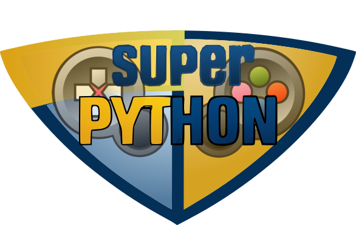

<!---
Open Source program Pynoplia - Copyright © 2024  Carlo Oliveira** <carlo@nce.ufrj.br>,
PDX-License-Identifier:** `GNU General Public License v3.0 or later <http://is.gd/3Udt>`_.
-->
# Pynoplia - Os Instrumentos do Python
> E agora para algo totalmente diferente!  
> Aprenda Python resolvendo, modificando e criando desafios e jogos

### Ficha Técnica da Plataforma Pynóplia

**Autor:** `Carlo E. T. Oliveira`  
**Affiliation:** `Universidade Federal do Rio de Janeiro`  
**License:** `GNU General Public License v3 or later (GPLv3+)` 
**Homepage:** [Pynoplia Aprenda Python com Jogos] 
**Changelog:** [CHANGELOG](CHANGELOG.md) 

[Pynoplia Aprenda Python com Jogos]: http://activufrj.nce.ufrj.br/wiki/labase/Pynoplia_-_Aprenda_Python_com_Jogos
